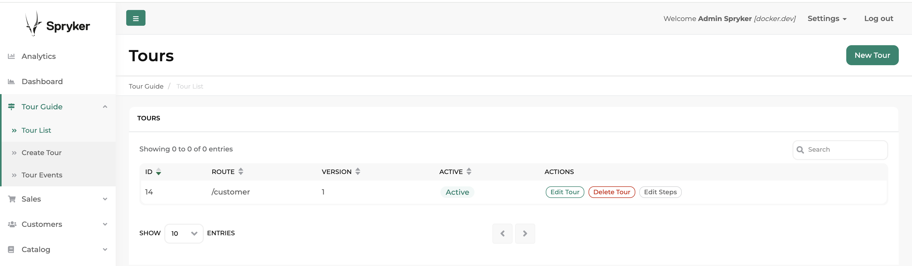

# Tour Guide

A Spryker module for creating and managing guided tours through your application. This module helps onboard new users and guide them through complex workflows by providing step-by-step instructions directly within the application interface.

## Features

- Create and manage tour guides for different sections of your application
- Define multiple steps for each tour guide with customizable content
- Associate tour guides with specific routes in your application
- Retrieve tour guides and steps based on various criteria
- Easily integrate with existing Spryker applications

## Installation

### Requirements

- PHP 8.2 or higher
- Spryker Kernel 3.52.0 or higher

### Installation Steps

### 1. Install Package

Install the package via Composer:

```bash
composer require spryker-community/tour-guide
```

### 2. Integrate ZED Controller

To make the OMS Visualizer accessible through your Spryker application, follow these steps:

1. Add the `SprykerCommunity` namespace to `CORE_NAMESPACES` in your project's `config_default.php` file:

```php
$config[KernelConstants::CORE_NAMESPACES] = [
    'SprykerShop',
    'SprykerEco',
    'Spryker',
    'SprykerCommunity', // Add this line if not exist
];
```

2. Run the following console commands inside the `docker/sdk cli` to update caches:

```bash
vendor/bin/console transfer:generate
vendor/bin/console cache:empty-all
```

### 3. Install Frontend Assets

The OMS Visualizer uses Mermaid JS for graph visualization. Follow these steps to install the necessary frontend dependencies and assets:

1. Add the `spryker-community` workspace to the root `package.json` of your project:

```
"workspaces": [
   "vendor/spryker/*",
   "vendor/spryker-community/*",
   "vendor/spryker/*/assets/Zed",
   "vendor/spryker-community/*/assets/Zed"
],
```

2. Install all JavaScript dependencies from the `/vendor/spryker-community` directory and compile them for use in your Zed application:

```bash
npm install
```

3. Create a new file at `./frontend/zed/build.js` with the following content:

```javascript
'use strict';

const oryxForZed = require('@spryker/oryx-for-zed');
const path = require('path');
const api = require('@spryker/oryx-for-zed/lib');
const build = require('@spryker/oryx-for-zed/lib/build');
const copyAssetsCallback = require('@spryker/oryx-for-zed/lib/copy');

// Add the OMS Visualizer package to the build process
oryxForZed.settings.entry.dirs.push(path.resolve('./vendor/spryker-community'));

api.getConfiguration(oryxForZed.settings)
    .then((configuration) => build(configuration, copyAssetsCallback))
    .catch((error) => console.error('An error occurred while creating configuration', error));
```

4. Update your project's `package.json` file to include your `./frontend/zed/build.js` as build script:

```
"scripts": {
   "zed": "node ./frontend/zed/build",
   "other-scripts": "your-other-scripts"
}
```

Note: Replace "other-scripts" with your existing script entries.

5. Run the build command to install and compile the frontend assets:

```bash
npm run zed
```

### 4. Run the database migration

```bash
console propel:install
```

### 5. Add Twig Plugin

Add `TourGuideTwigFunctionPlugin` to your `TwigDependencyProvider`,

### 6. Call Twig function to ZED template

Override `src/Pyz/Zed/Gui/Presentation/Layout/layout.twig` on project level or choose a specific template of any module and add:

```
{{ renderTourGuideAssets() }}
```

Run `vendor/bin/console twig:cache:warmer` afterward.

### 7. Add navigation entry

To have a separate navigation menu for the new Tour Guide, copy the content from `src/SprykerCommunity/Zed/Communication/navigation.xml` into your `config/Zed/navigation.xml`.

Clear the cache for navigation:

```
vendor/bin/console application:build-navigation-cache
```

## Screenshot



## License

This package is released under the MIT license.
