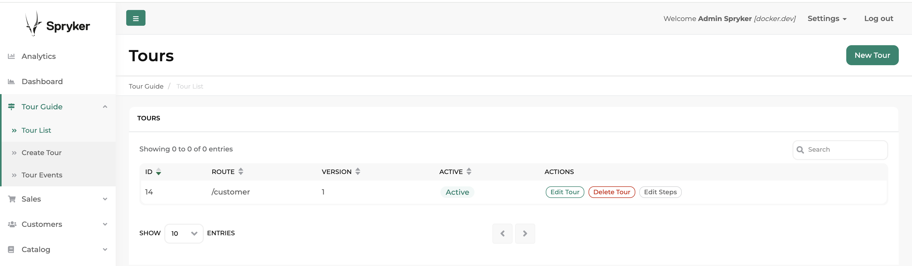
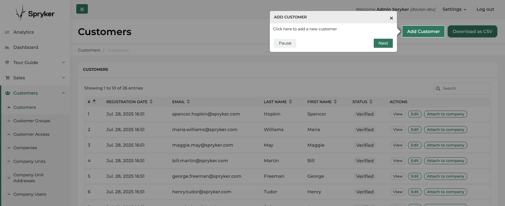

# Spryker Tour Guide for Backoffice

A Spryker module for creating and managing guided tours through your application. This module helps onboard new users and guide them through complex workflows by providing step-by-step instructions directly within the application interface.

## Features

- Create and manage tours for different Backoffice modules
- Define multiple steps for each tour with customizable content
- Assign tours to different user groups
- Adjust order of steps at any time
- Each tour can be paused, canceled or closed
- Restart tour at any time from footer navigation item
- Analyze tour events via Backoffice

## Installation

### Requirements

- PHP 8.2 or higher
- Spryker Kernel 3.52.0 or higher

### Installation Steps

#### 1. Install Package

Add repository to your `composer.json`:

```
{
    "type": "git",
    "url": "https://github.com/spryker-community/quest-2107-guided-tour-feature.git"
}
```

Install the package via Composer:

```bash
composer require spryker-community/quest-2107-guided-tour-feature:dev-main
```

#### 2. Integrate ZED Controller

To make the OMS Visualizer accessible through your Spryker application, follow these steps:

1. Add the `SprykerCommunity` namespace to `CORE_NAMESPACES` in your project's `config_default.php` file:

```php
$config[KernelConstants::CORE_NAMESPACES] = [
    'SprykerShop',
    'SprykerEco',
    'Spryker',
    'SprykerCommunity', // Add this line if not exist
];
```

2. Run the following console commands inside the `docker/sdk cli` to update caches:

```bash
vendor/bin/console transfer:generate
vendor/bin/console cache:empty-all
```

#### 3. Install Frontend Assets

The OMS Visualizer uses Mermaid JS for graph visualization. Follow these steps to install the necessary frontend dependencies and assets:

1. Add the `spryker-community` workspace to the root `package.json` of your project:

```
"workspaces": [
   "vendor/spryker/*",
   "vendor/spryker-community/*",
   "vendor/spryker/*/assets/Zed",
   "vendor/spryker-community/*/assets/Zed"
],
```

2. Create a new file at `./frontend/zed/build.js` with the following content:

```javascript
'use strict';

const oryxForZed = require('@spryker/oryx-for-zed');
const path = require('path');
const api = require('@spryker/oryx-for-zed/lib');
const build = require('@spryker/oryx-for-zed/lib/build');
const copyAssetsCallback = require('@spryker/oryx-for-zed/lib/copy');

oryxForZed.settings.entry.dirs.push(path.resolve('./vendor/spryker-community'));

api.getConfiguration(oryxForZed.settings)
    .then((configuration) => build(configuration, copyAssetsCallback))
    .catch((error) => console.error('An error occurred while creating configuration', error));
```

3. Update your project's `package.json` file to include your `./frontend/zed/build.js` as build script:

```
"scripts": {
   "zed": "node ./frontend/zed/build",
   "other-scripts": "your-other-scripts"
}
```

Note: Replace "other-scripts" with your existing script entries.

4. Run the build command to install and compile the frontend assets:

```bash
npm run zed
```

#### 4. Run the database migration

```bash
console propel:install
```

#### 5. Add Twig Plugin

Add `TourGuideTwigFunctionPlugin` to your `DependencyProvider` at `src/Pyz/Zed/Twig/TwigDependencyProvider.php`,

#### 6. Call Twig function to ZED template

Override `src/Pyz/Zed/Gui/Presentation/Layout/layout.twig` on project level or choose a specific template of any module and add:

```
{{ renderTourGuideAssets() }}
```

Run `vendor/bin/console twig:cache:warmer` afterward.

#### 7. Add navigation entry

To have a separate navigation menu for the new Tour Guide, copy the content from `src/SprykerCommunity/Zed/Communication/navigation.xml` into your `config/Zed/navigation.xml`.

Clear the cache for navigation:

```
vendor/bin/console application:build-navigation-cache
```

### Create a Tour

#### 1. Add a new tour
Open the **Tour Guide** from the main navigation and click the **New Tour** button.

Select the route of the backend module where you want to create the tour, and enter a version number. Optionally, you can also assign the tour to a specific user group.

#### 2. Add tour steps
Click the **Add Step** button to define the steps of your tour. For each step, provide:
- A **title** and **description text**
- A **unique CSS selector** (e.g., `a[href="/customer/add"]`) that identifies the element the step should highlight
- The **position** where the modal should appear

Finally, activate the step.

#### 3. Activate the tour
Once all steps have been added, activate the tour. It will now be available to backend users when they open the related backend module.

Users can restart the tour at any time by clicking the tour icon in the bottom-right corner (if a tour is available).

#### 4. Tracking tour event
Each event of each tour and user can be seen in the "Tour Events" section. It is possible to narrow it down by event type and tour route.

## Screenshot



---



## License

This package is released under the MIT license.
